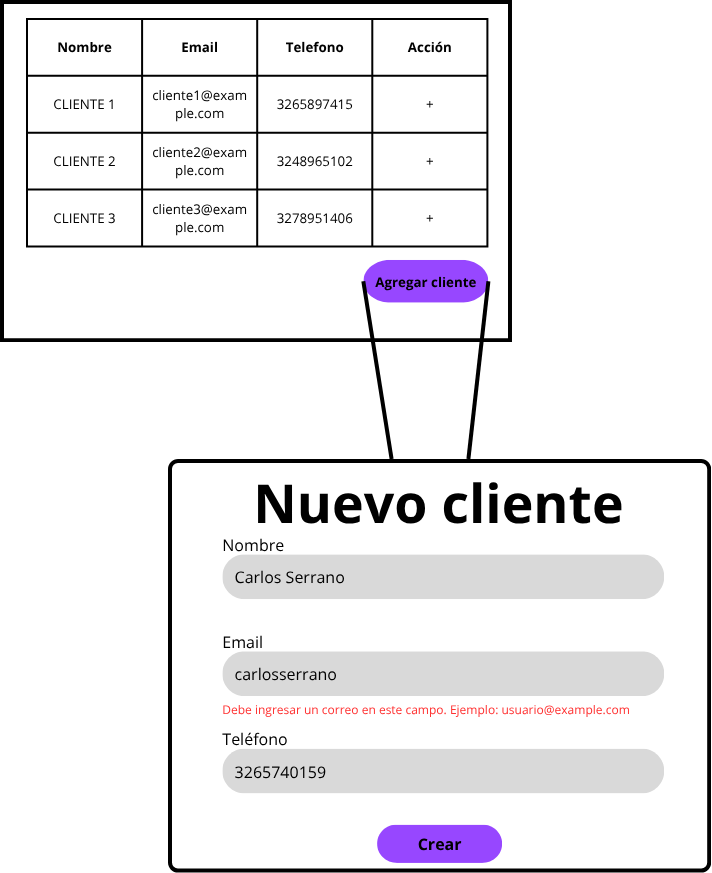

# Microfrontend de Gestión de Clientes

Este proyecto es un microfrontend desarrollado con Angular que proporciona funcionalidades para la gestión de clientes, incluyendo la creación, edición, listado y eliminación de registros de clientes.

## Características

- Interfaz moderna con Material Design
- Listado de clientes con paginación y ordenamiento
- Filtrado en tiempo real
- Formularios reactivos para creación y edición
- Eliminación de clientes con confirmación

## Requisitos Previos

- Node.js (v14 o superior)
- npm (v6 o superior)
- Angular CLI

## Instalación

1. Clonar el repositorio:
```bash
git clone https://github.com/DanielaFajardo2315/customers-mfe.git
cd customers-mfe
```

2. Instalar dependencias:
```bash
npm install
```

3. Iniciar el servidor de desarrollo:
```bash
ng serve -o
```

La aplicación estará disponible en `http://localhost:4201`

## Estructura del Proyecto

```
customers-mfe/
├── src/
│   ├── app/
│   │   ├── components/
│   │   │   ├── customer-list/       # Listado de clientes en tabla
│   │   │   ├── customer-form/       # Formulario de edición
│   │   │   ├── customer-form-create/# Formulario de creación
│   │   │   ├── navbar/             # Barra de navegación
│   │   │   └── footer/             # Pie de página
│   │   ├── services/
│   │   │   └── customers.ts        # Servicios de API
│   │   ├── interfaces/
│   │   │   └── customer.ts         # Interfaces y tipos
│   │   └── environments/           # Configuraciones por entorno
│   └── assets/                     # Recursos estáticos
└── ...
```

## Características Técnicas

- **Framework**: Angular 20
- **UI Library**: Angular Material
- **Formularios**: Reactive Forms
- **Estilo**: CSS
- **Notificaciones**: SweetAlert2
- **HTTP**: HttpClient para comunicación con API
- **Estado**: Servicios de Angular para gestión de estado

## API Endpoints

El microfrontend se comunica con una API REST con los siguientes endpoints:

- `GET /users` - Obtener lista de clientes
- `POST /users` - Crear nuevo cliente
- `PUT /users/:id` - Actualizar cliente existente
- `DELETE /users/:id` - Eliminar cliente

## Configuración

Las configuraciones de entorno se encuentran en:
- `src/environments/environment.ts` - Configuración por defecto
- `src/environments/environment.dev.ts` - Configuración de desarrollo
- `src/environments/environment.prod.ts` - Configuración de producción

## Convenciones de Código

- Componentes standalone con importaciones específicas
- Uso de inyección de dependencias con `inject()`
- Tipado estricto con TypeScript
- Interfaces para modelos de datos
- Formularios reactivos para manejo de datos
- Servicios para lógica de negocio
- Material Dialog para modales

## Autor

Daniela Fajardo - [DanielaFajardo2315](https://github.com/DanielaFajardo2315)

## Desiciones técnicas

- Debido a el uso de la versión más reciente de Angular (versión 20) es sugerido el uso de Native Federation debido a que es más moderno, rápido y tiene mejor integración con Angular CLI, sin embargo, se tiene en cuenta que al usar Native Federation también se tienen ciertas desventajas por lo moderno que es, como que existen menos casos de producción, menos documentación disponible y puede tener posibles errores aún no descubiertos; por tal razón se decide el uso de Webpack Module Federation tradicional que es más maduro y probado en producción, funciona con cualquier framework y es compatible con otras versiones de Angular.
- Se definió el siguiente Mockup básico para la ejecución del proyecto, teniendo en cuenta las necesidades y contexto inicial del reto.
